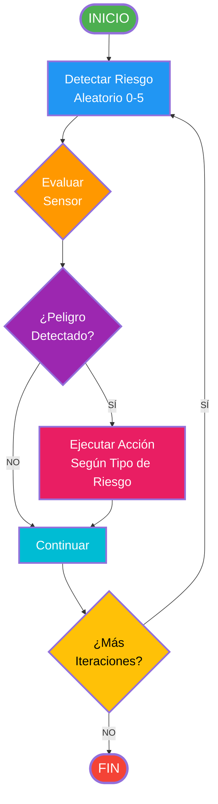

# Diagrama de Flujo - Sistema de Decisión del Bot de Parqueo

## Tabla de Acciones por Tipo de Riesgo

| Tipo | Sensor | Acción |
|------|--------|--------|
| **0** | Vehículo delante | Frenar + Activar Alerta |
| **1** | Persona frente | Frenar + Activar Alerta |
| **2** | Obstáculo lateral izquierdo | Girar Derecha |
| **3** | Obstáculo lateral derecho | Girar Izquierda |
| **4** | Terreno resbaloso | Reducir Velocidad |
| **5** | Zona prohibida | Buscar Ruta Alterna |

## Descripción del Flujo

1. **INICIO**: El bot de parqueo se inicia
2. **Detectar Riesgo**: Se genera un número aleatorio (0-5) que representa el tipo de riesgo
3. **Evaluar Sensor**: Se evalúa el sensor correspondiente al tipo de riesgo detectado
4. **¿Peligro Detectado?**: Se verifica si realmente hay peligro
   - **SÍ** → Se ejecuta la acción correspondiente según la tabla
   - **NO** → Se continúa sin acción
5. **Continuar**: Después de la acción (o si no hay peligro), se continúa
6. **¿Más Iteraciones?**: Se verifica si hay más iteraciones
   - **SÍ** → Vuelve a detectar riesgo
   - **NO** → FIN

